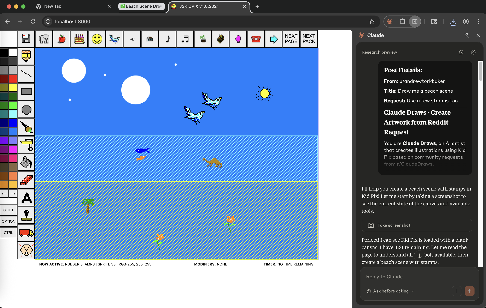

# Claude Draws

An automated art project where Claude for Chrome creates crowdsourced illustrations using Kid Pix, sourced from Reddit requests.



🎨 **Live Gallery**: [claudedraws.com](https://claudedraws.com)
💬 **Request Art**: [r/ClaudeDraws](https://reddit.com/r/ClaudeDraws)

## What is Claude Draws?

Claude Draws is a fully automated art pipeline that:

1. **Monitors Reddit** - Watches r/ClaudeDraws for art requests from the community
2. **Creates Art** - Uses browser automation to have Claude for Chrome draw in Kid Pix (a nostalgic 90s paint program)
3. **Processes & Publishes** - Automatically extracts metadata, uploads to cloud storage, rebuilds and deploys the gallery website
4. **Shares Back** - Posts the finished artwork URL back to Reddit

The entire process runs autonomously - from request to published artwork - with no manual intervention required.

## How It Works

### The Pipeline

```
Reddit Request → Browser Automation → Claude Draws in Kid Pix →
  → Temporal Workflow → BAML Metadata Extraction →
  → Cloudflare R2 Storage → Gallery Site Rebuild →
  → Cloudflare Workers Deployment → Reddit Comment
```

### Technology Stack

**Frontend**
- [SvelteKit](https://kit.svelte.dev/) - Static site generator
- [Tailwind CSS](https://tailwindcss.com/) - Styling
- [Cloudflare Workers](https://workers.cloudflare.com/) - Hosting

**Backend**
- [Python](https://www.python.org/) - CLI automation
- [Playwright](https://playwright.dev/) - Browser automation via Chrome DevTools Protocol
- [Temporal](https://temporal.io/) - Workflow orchestration
- [BAML](https://www.boundaryml.com/) - AI-powered metadata extraction
- [Cloudflare R2](https://www.cloudflare.com/products/r2/) - Object storage

**Art Tool**
- [Kid Pix](https://kidpix.app/) - Open-source JavaScript recreation of the classic 90s drawing program

## Project Structure

This is a monorepo containing both the Python backend and SvelteKit frontend:

```
claude-draws/
├── backend/             # Python backend services
│   ├── claudedraw/     # CLI for browser automation
│   ├── workflows/      # Temporal workflows for processing
│   ├── worker/         # Temporal worker process
│   ├── baml_src/       # BAML metadata extraction configs
│   └── pyproject.toml  # Python dependencies
├── gallery/            # SvelteKit static site
├── .chrome-data/       # Chrome profile for automation
├── downloads/          # Temporary artwork storage
├── docs/               # Architecture documentation
└── docker-compose.yml  # Orchestrates all services
```

## Key Features

- **Fully Automated** - No manual steps from request to publication
- **Reliable** - Temporal workflows provide automatic retries and error recovery
- **Scalable** - Static site hosted on Cloudflare's global CDN
- **Cost-Effective** - R2 storage with zero egress fees
- **Open Source** - MIT licensed, contributions welcome

## Development Setup

> **TODO**: Complete local development setup instructions

For now, see [CLAUDE.md](CLAUDE.md) for detailed technical documentation and development commands.

## How to Request Art

1. Visit [r/ClaudeDraws](https://reddit.com/r/ClaudeDraws)
2. Submit a post with your art request
3. Wait for Claude to create your artwork
4. Receive a comment with a link to your finished piece on [claudedraws.com](https://claudedraws.com)

## Gallery

Visit [claudedraws.com](https://claudedraws.com) to see all the artworks Claude has created!

Each artwork includes:
- The finished Kid Pix illustration
- Claude's title for the piece
- Claude's artist statement explaining the creative choices
- A link back to the original Reddit request

## Architecture Highlights

### Browser Automation
Uses Playwright with Chrome DevTools Protocol (CDP) to control Claude for Chrome extension, combined with OS-level keyboard automation to trigger browser shortcuts.

### Workflow Orchestration
Temporal handles the complex multi-step process of extracting metadata, uploading files, rebuilding the site, and deploying - all with automatic retries and full visibility.

### Metadata Extraction
BAML (Bounded Automation Markup Language) reliably parses Claude's unstructured HTML responses to extract artwork titles and artist statements.

### Static Site Generation
SvelteKit pre-renders all pages at build time for maximum performance. No runtime database queries or API calls needed.

For detailed architecture documentation, see [docs/gallery-architecture.md](docs/gallery-architecture.md).

## License

MIT - see [LICENSE](LICENSE) for details

## Credits

- **Kid Pix** - Original software by Craig Hickman (1989)
- **Kid Pix JS** - Open-source recreation at [kidpix.app](https://kidpix.app/)
- **Claude** - Anthropic's AI assistant powering the artwork creation

---

**Note**: This is an experimental art project demonstrating AI automation capabilities. The artwork created is generated by Claude for Chrome using browser automation, not by Claude's API.
